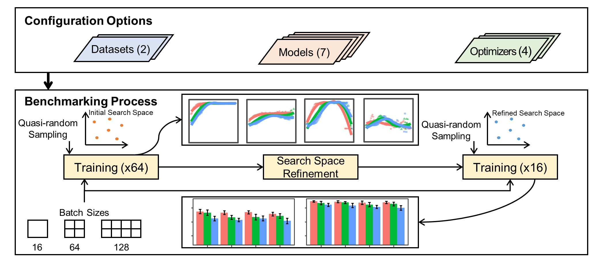

# Fault Diagnosis Optimizer Benchmark

This is the repository for the benchmark study article `Impact of Deep Learning Optimizers and Hyperparameter Tuning on the Performance of Bearing Fault Diagnosis`. 

# Description

We implemented end-to-end optimization benchmark code using public bearing fault datasets and state-of-the-art fault diagnosis models. This code provides public dataset download, data preprocessing, quasi-random hyperparameter sampling, and model training.



# Requirements

To use this code, we recommended to install libraries on the anaconda virtual environment. Required libraries will be installed following instructions below.

```
conda create -n {your virtual env name} python=3.10.6
conda activate {your virtual env name}
pip install --upgrade pip
pip install -r requirements.txt
```

`Note`: We tested this code in PC using Ubuntu Linux and CUDA GPU. Experimental specifications are listed below.

|Type|Specification|
|------|---|
|OS|Ubuntu 18.04|
|CPU|Intel Core i9-10900K @ 3.70 GHz|
|RAM|128 GB|
|GPU|NVIDIA GeForce RTX 2080 SUPER x2|
|CUDA version|11.2|
|CUDNN version|7.6.5|

# Getting Started

We provide short demo code. Check `tutorial.ipynb`.

# License

MIT License.

# Citation

If this code is helpful, please cite our paper:

Our paper is currently available as early access version. [Link](https://ieeexplore.ieee.org/document/10141610/keywords#keywords)

```
@ARTICLE{10141610,
  author={Lee, Seongjae and Kim, Taehyoun},
  journal={IEEE Access}, 
  title={Impact of Deep Learning Optimizers and Hyperparameter Tuning on the Performance of Bearing Fault Diagnosis}, 
  year={2023},
  volume={},
  number={},
  pages={1-1},
  doi={10.1109/ACCESS.2023.3281910}}
```